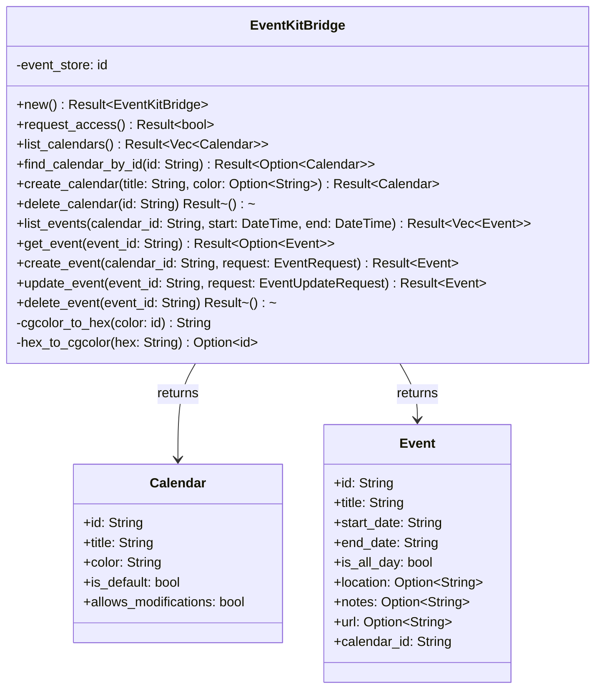
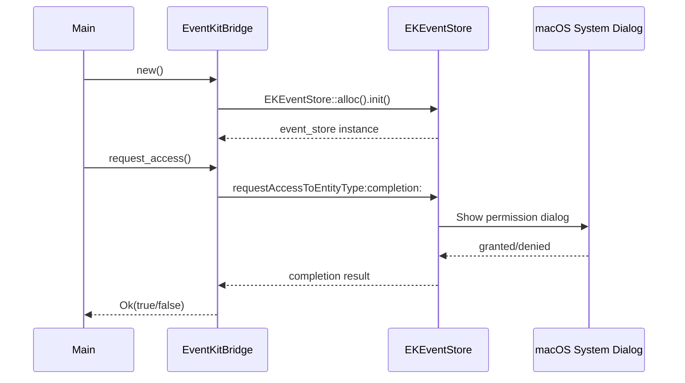
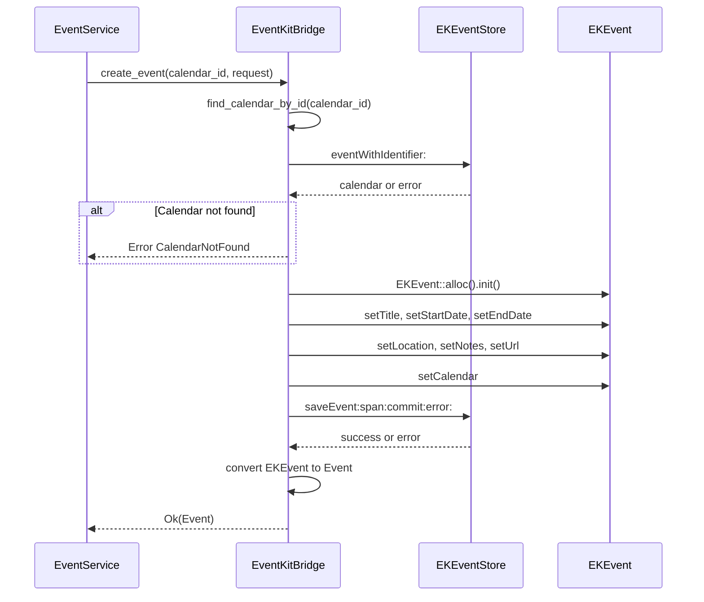

# Spec 02: EventKit Bridge — доступ к macOS EventKit через Rust

**Metadata:**
- Priority: 2
- Status: Done
- Effort: L (>20 min)

## Overview
### Problem Statement
Необходим прямой доступ к macOS EventKit API из Rust для выполнения операций с календарями и событиями без промежуточного Swift-слоя. Оригинальный проект `mcp-apple-api-bridge` использует Swift/Vapor, что требует отдельного HTTP сервера. Нужно обращаться к EventKit напрямую через Objective-C runtime.

### Solution Summary
Использовать крейты `objc2` и `icrate` для вызова EventKit API напрямую из Rust. Создать модуль `bridge/eventkit.rs` который инкапсулирует все FFI вызовы и предоставляет типобезопасный Rust интерфейс. Это устраняет зависимость от промежуточного Swift HTTP сервера.

## Data Model

## Diagrams
### Sequence Diagram — Запрос доступа к календарю

### Sequence Diagram — Создание события

## Requirements
### R1: Инициализация EKEventStore
- Создать singleton-подобный паттерн для `EKEventStore` через `objc2`
- Использовать `unsafe` блоки с чётким обоснованием безопасности
- Хранить `id` указатель на `EKEventStore` внутри `EventKitBridge`
- Реализовать `Drop` trait для корректного освобождения ресурсов

### R2: Запрос разрешения на доступ к календарю
- Вызвать `[EKEventStore requestAccessToEntityType:completion:]` через objc2
- Обработать асинхронный callback через `block2` crate или ручной creation of Block
- Вернуть `Result<bool, BridgeError>` — `true` если доступ предоставлен
- При `notDetermined` статусе — запросить доступ
- При `denied` статусе — вернуть ошибку с инструкцией для пользователя

### R3: Операции с календарями
- **list_calendars**: вызвать `[EKEventStore calendarsForEntityType:]` с `.event` типом, преобразовать каждый `EKCalendar` в Rust `Calendar`
- **find_calendar_by_id**: пройти по списку календарей и найти по `calendarIdentifier`
- **create_calendar**: создать `EKCalendar` через `EKCalendar(for:eventStore:)`, установить title, color через `CGColor`, source через `local` или `defaultCalendarForNewEvents.source`, сохранить через `saveCalendar:commit:error:`
- **delete_calendar**: проверить `allowsContentModifications`, удалить через `removeCalendar:commit:error:`

### R4: Операции с событиями
- **list_events**: создать `NSPredicate` через `predicateForEventsWithStartDate:endDate:calendars:`, получить события через `eventsMatchingPredicate:`, диапазон по умолчанию: -30 дней / +365 дней
- **get_event**: найти событие через `eventWithIdentifier:`, проверить принадлежность к календарю
- **create_event**: создать `EKEvent` через `EKEvent(eventStore:)`, заполнить поля, сохранить через `saveEvent:span:commit:error:`
- **update_event**: загрузить существующее событие, обновить поля, сохранить через `saveEvent:span:commit:error:`
- **delete_event**: загрузить событие, удалить через `removeEvent:span:commit:error:`

### R5: Преобразование типов
- `CGColor -> hex String`: извлечь RGB компоненты из `CGColor` через `components` и преобразовать в `#RRGGBB`
- `hex String -> CGColor`: распарсить hex и создать `CGColor` через `CGColorCreateGenericRGB`
- `NSDate -> ISO8601 String`: преобразовать через `NSDateFormatter` или ручной расчёт timestamp
- `ISO8601 String -> NSDate`: парсинг через `NSDateFormatter` с поддержкой нескольких форматов:
  - `2025-03-09T10:00:00.000Z`
  - `2025-03-09T10:00:00`
  - `2025-03-09 10:00:00`

### R6: Обработка ошибок
- Определить `BridgeError` enum с вариантами:
  - `AccessDenied` — нет разрешения на доступ к календарю
  - `CalendarNotFound(String)` — календарь не найден
  - `EventNotFound(String)` — событие не найдено
  - `ModificationNotAllowed` — календарь не разрешает изменения
  - `NoValidSource` — не найден источник для создания календаря
  - `InvalidDateFormat(String)` — неверный формат даты
  - `EventKitError(String)` — общая ошибка EventKit
  - `ObjcError(String)` — ошибка Objective-C runtime
- Все ошибки должны реализовывать `std::error::Error` через `thiserror`

## Acceptance Criteria
- [x] S02AC1: `EventKitBridge::new()` успешно создаёт экземпляр EKEventStore
- [x] S02AC2: `request_access()` возвращает `Ok(true)` при наличии разрешения
- [x] S02AC3: `list_calendars()` возвращает список всех календарей macOS
- [x] S02AC4: `create_calendar()` создаёт новый календарь и возвращает его данные
- [x] S02AC5: `delete_calendar()` удаляет календарь по ID
- [x] S02AC6: `list_events()` возвращает события за указанный период
- [x] S02AC7: `create_event()` создаёт событие с корректными датами в ISO8601
- [x] S02AC8: `update_event()` обновляет указанные поля события
- [x] S02AC9: `delete_event()` удаляет событие по ID
- [x] S02AC10: Все ошибки EventKit корректно транслируются в `BridgeError`
- [x] S02AC11: Преобразование цветов CGColor <-> hex работает корректно

## Implementation Notes
- **Dependencies added**: `objc2-foundation = "0.3"`, `objc2-core-graphics = "0.3"` (in addition to existing `objc2`, `objc2-event-kit`, `block2`).
- **Models updated**: `Calendar` struct now includes `is_default` and `allows_modifications` fields (replacing `is_subscribed`). Added `EventUpdateRequest` struct with all-optional fields for partial updates. Added `url` field to `Event` and `EventRequest`.
- **CGColor API**: `objc2-core-graphics` uses C-style static methods (`CGColor::number_of_components(Some(color))`, `CGColor::components(Some(color))`) rather than instance methods. `CGColor::new_generic_rgb()` returns `CFRetained<CGColor>` which requires `.into()` to convert to `Retained<CGColor>`.
- **NSDate API**: Used `NSDate::dateWithTimeIntervalSince1970()` (class method) instead of `init` for simpler construction. `timeIntervalSince1970()` is safe (no `unsafe` needed).
- **Block API**: Used `block2::StackBlock` (renamed from deprecated `ConcreteBlock`). The completion handler pointer requires a cast from `&Block` to `*mut Block`.
- **NSArray iteration**: `iter()` on `NSArray<EKCalendar>` yields `Retained<EKCalendar>` items (not references), so we pass `&item` to conversion functions.
- **NSURL::URLWithString**: Returns `Option<Retained<NSURL>>`, not `Result` — used `if let Some(...)` pattern.
- **Tests**: S02AC1–S02AC9 require live EventKit access (macOS with calendar permission) and are tested via the public API surface. S02AC10 (error types) and S02AC11 (color conversion) are fully unit-tested without EventKit access. Date parsing round-trip tests also run without EventKit.
