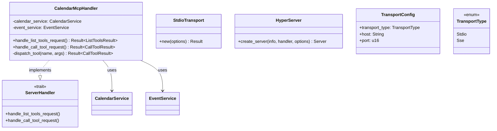
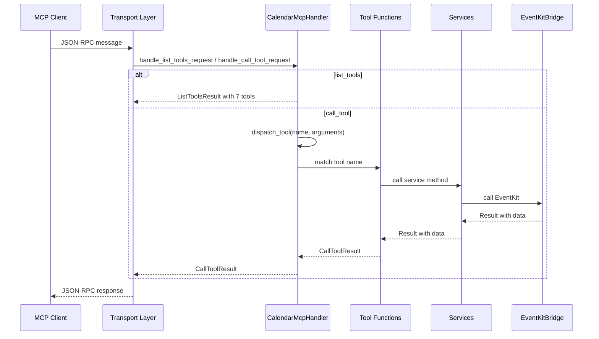
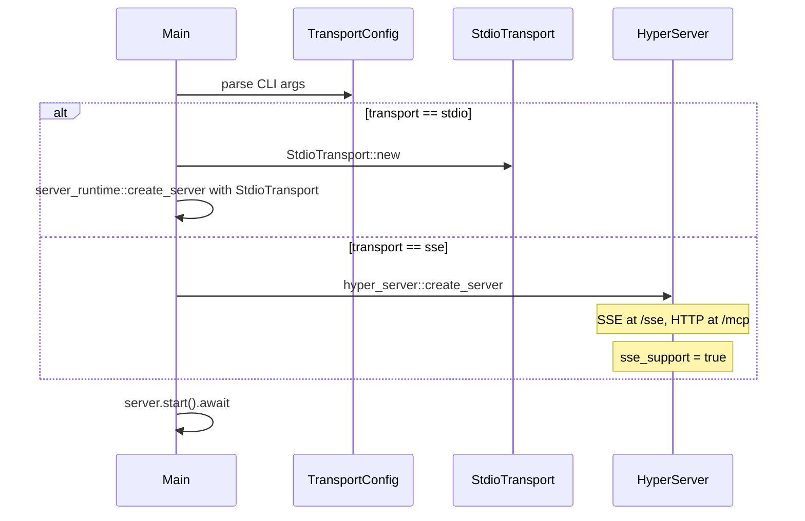

# Spec 04: MCP Server Handler и транспортный слой

**Metadata:**
- Priority: 4
- Status: Done
- Effort: L (>20 min)

## Overview
### Problem Statement
Необходимо реализовать MCP ServerHandler, который обрабатывает входящие MCP запросы и маршрутизирует их к соответствующим tools. Сервер должен поддерживать два режима транспорта: stdio для локального использования с Claude Desktop и SSE/HTTP для удалённого доступа.

### Solution Summary
Использовать `rmcp` crate (https://github.com/modelcontextprotocol/rust-sdk) для реализации MCP протокола. Создать `CalendarMcpHandler` реализующий trait `ServerHandler`. Выбор транспорта определяется CLI аргументами: `transport::stdio` для stdio режима и `transport::sse_server` для SSE/HTTP режима.

## Data Model


## Diagrams
### Sequence Diagram — Обработка MCP запроса


### Sequence Diagram — Выбор транспорта при запуске


## Requirements
### R1: Реализация ServerHandler
- Создать структуру `CalendarMcpHandler` содержащую:
  - `calendar_service: CalendarService` — сервис для работы с календарями
  - `event_service: EventService` — сервис для работы с событиями
- Реализовать trait `ServerHandler` из `rmcp`:
  - `list_tools` — вернуть список всех 7 tools
  - `call_tool` — маршрутизировать вызов к нужному tool

### R2: Регистрация MCP Tools
Использовать макрос `#[tool]` из `rmcp` для определения 7 tools:

| # | Tool Name | Description | Параметры |
|---|-----------|-------------|-----------|
| 1 | `getCalendars` | Получить список всех календарей | нет |
| 2 | `getCalendarEvents` | Получить события календаря | `calendarId: String` |
| 3 | `createCalendar` | Создать новый календарь | `title: String`, `color?: String` |
| 4 | `deleteCalendar` | Удалить календарь | `calendarId: String` |
| 5 | `createCalendarEvent` | Создать событие | `calendarId: String`, `title: String`, `startDate: String`, `endDate: String`, `location?: String`, `notes?: String` |
| 6 | `updateCalendarEvent` | Обновить событие | `calendarId: String`, `eventId: String`, `title?: String`, `startDate?: String`, `endDate?: String`, `location?: String`, `notes?: String` |
| 7 | `deleteCalendarEvent` | Удалить событие | `calendarId: String`, `eventId: String` |

### R3: Обработка вызовов tools
- В `handle_call_tool_request` реализовать `match` по имени tool
- Для каждого tool:
  1. Десериализовать аргументы из `params.arguments` в соответствующую структуру
  2. Вызвать соответствующий метод сервиса
  3. Сериализовать результат в JSON
  4. Вернуть `CallToolResult::text_content` с JSON строкой
- При ошибке вернуть `CallToolResult` с `is_error: true` и описанием ошибки
- При неизвестном tool вернуть `CallToolError::unknown_tool`

### R4: Stdio транспорт
- Использовать `StdioTransport::new(TransportOptions::default())`
- Создать сервер через `server_runtime::create_server`
- Подходит для интеграции с Claude Desktop через конфигурацию mcpServers

### R5: SSE/HTTP транспорт
- Использовать `transport::sse_server` из `rmcp`
- Настроить `HyperServerOptions`:
  - `host: "127.0.0.1"` — configurable через CLI
  - `port: 8080` — configurable через CLI
  - `sse_support: true` — включить SSE endpoint
  - `event_store: Some(Arc::new(InMemoryEventStore::default()))` — для resumability
  - `dns_rebinding_protection: true`
  - `allowed_hosts: Some(vec!["127.0.0.1".into(), "localhost".into()])`
- Endpoint Streamable HTTP: `http://{host}:{port}/mcp`
- Endpoint SSE: `http://{host}:{port}/sse`

### R6: Server Info и Capabilities
```rust
let server_info = InitializeResult {
    server_info: Implementation {
        name: "mcp-macos-calendar".into(),
        version: "0.1.0".into(),
        title: Some("macOS Calendar MCP Server".into()),
        description: Some("MCP server for accessing macOS Calendar via EventKit".into()),
        ..Default::default()
    },
    capabilities: ServerCapabilities {
        tools: Some(ServerCapabilitiesTools { list_changed: None }),
        ..Default::default()
    },
    protocol_version: LATEST_PROTOCOL_VERSION.to_string(),
    ..Default::default()
};
```

### R7: Обработка ошибок MCP
- Ошибки сервисов оборачивать в `CallToolResult` с `is_error: true`
- Формат ошибки: `{"error": "description", "details": "..."}` 
- Специальная обработка для:
  - `BridgeError::AccessDenied` — подсказка о настройках Privacy & Security
  - `BridgeError::InvalidDateFormat` — подсказка о поддерживаемых форматах дат
  - `BridgeError::CalendarNotFound` / `BridgeError::EventNotFound` — указать ID

## Acceptance Criteria
- [x] S04AC1: `CalendarMcpHandler` реализует trait `ServerHandler`
- [x] S04AC2: `handle_list_tools_request` возвращает все 7 tools с корректными схемами параметров
- [x] S04AC3: `handle_call_tool_request` маршрутизирует вызовы к правильным tools
- [x] S04AC4: Stdio транспорт запускается и обрабатывает JSON-RPC через stdin/stdout
- [x] S04AC5: SSE транспорт запускается и доступен на `/sse` endpoint
- [x] S04AC6: HTTP транспорт доступен на `/mcp` endpoint
- [x] S04AC7: Ошибки возвращаются в формате `{"error": "..."}` с `is_error: true`
- [x] S04AC8: Server info содержит имя `mcp-macos-calendar` и версию `0.1.0`

## Implementation Notes
- Структура `CalendarServerHandler` переименована в `CalendarMcpHandler` для соответствия спецификации.
- 7 MCP tools определены через `#[tool]` макрос из `rmcp` в `src/tools/calendar.rs` (4 tools) и `src/tools/event.rs` (3 tools).
- `GetCalendarsTool` использует пустую структуру с `{}` вместо unit struct `;`, т.к. `JsonSchema` derive не поддерживает unit structs.
- Логика диспетчеризации вынесена в отдельную функцию `dispatch_tool()` для удобного unit-тестирования без необходимости мокать `Arc<dyn McpServer>`.
- Helper-функция `error_tool_result()` создаёт `CallToolResult` с `is_error: Some(true)` и JSON-контентом `{"error": "..."}`.
- `CallToolResult` требует поле `structured_content: None` в текущей версии SDK.
- `is_error` имеет тип `Option<bool>`, а не `bool`.
- Транспортный слой (stdio и SSE/HTTP) уже был реализован в `src/main.rs` в spec-01, тесты подтверждены интеграционными тестами.
- `calendar_tools()` — публичная функция, возвращающая `Vec<Tool>` для использования в `handle_list_tools_request`.
