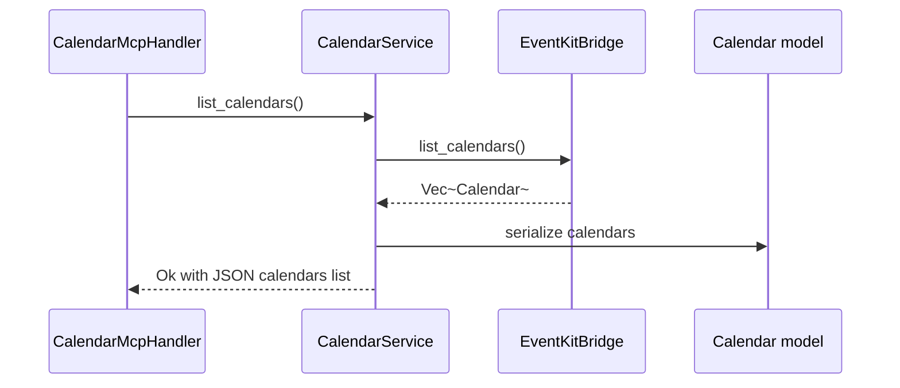
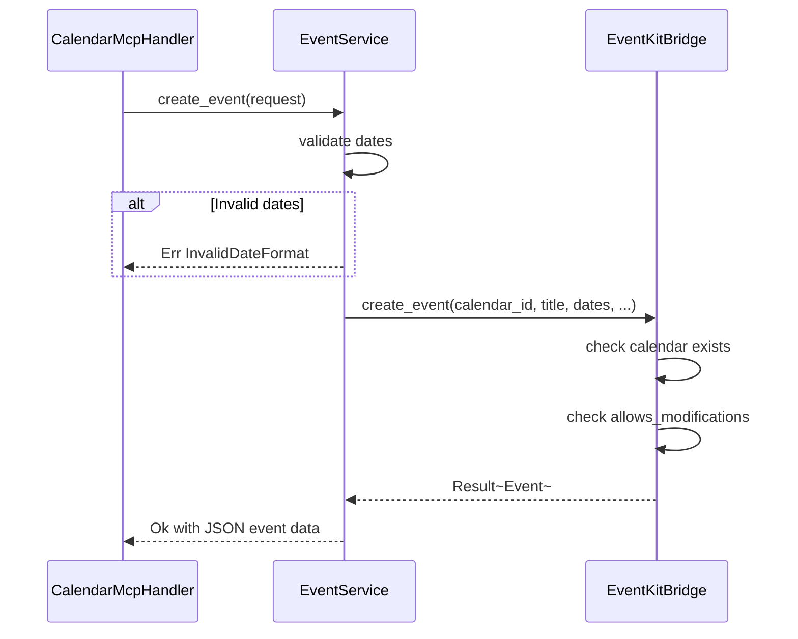

# Spec 05: Сервисный слой — CalendarService и EventService

**Metadata:**
- Priority: 5
- Status: Done
- Effort: M (10-20 min)

## Overview
### Problem Statement
Необходим промежуточный сервисный слой между MCP handler и EventKit bridge, который инкапсулирует бизнес-логику операций с календарями и событиями, валидацию входных данных и формирование ответов.

### Solution Summary
Создать два сервиса: `CalendarService` и `EventService` в модуле `src/services/`. Каждый сервис принимает `EventKitBridge` через reference и предоставляет высокоуровневые методы для MCP tools. Сервисы отвечают за валидацию, преобразование данных и формирование итоговых JSON ответов.

## Diagrams
### Sequence Diagram — CalendarService::list_calendars


### Sequence Diagram — EventService::create_event


## Requirements
### R1: CalendarService
Расположение: `src/services/calendar_service.rs`

Методы:
- **`list_calendars(&self) -> Result<Vec<Calendar>>`** — делегирует `bridge.list_calendars()`, возвращает список всех календарей
- **`get_calendar(&self, id: &str) -> Result<Calendar>`** — делегирует `bridge.find_calendar_by_id()`, возвращает ошибку `CalendarNotFound` если не найден
- **`create_calendar(&self, title: &str, color: Option<&str>) -> Result<Calendar>`** — валидирует title не пустой, делегирует `bridge.create_calendar()`, возвращает созданный календарь
- **`delete_calendar(&self, id: &str) -> Result<()>`** — делегирует `bridge.delete_calendar()`, возвращает подтверждение

### R2: EventService
Расположение: `src/services/event_service.rs`

Методы:
- **`list_events(&self, calendar_id: &str) -> Result<Vec<Event>>`** — проверяет существование календаря, делегирует `bridge.list_events()` с диапазоном -30 дней / +365 дней, возвращает список событий
- **`get_event(&self, calendar_id: &str, event_id: &str) -> Result<Event>`** — проверяет существование календаря, делегирует `bridge.get_event()`, проверяет принадлежность события к календарю
- **`create_event(&self, request: EventCreateRequest) -> Result<Event>`** — валидирует формат дат через `parse_flexible_date`, делегирует `bridge.create_event()`, возвращает созданное событие
- **`update_event(&self, request: EventUpdateRequest) -> Result<Event>`** — валидирует формат дат если предоставлены, делегирует `bridge.update_event()`, возвращает обновлённое событие
- **`delete_event(&self, calendar_id: &str, event_id: &str) -> Result<()>`** — проверяет существование календаря, делегирует `bridge.delete_event()`

### R3: Валидация в сервисном слое
- `title` не должен быть пустым при создании календаря/события
- `calendar_id` и `event_id` не должны быть пустыми строками
- Даты должны парситься через `parse_flexible_date` — при ошибке вернуть `BridgeError::InvalidDateFormat` с перечислением поддерживаемых форматов
- `start_date` должен быть раньше `end_date`
- При `color` — проверить валидность hex формата `#RRGGBB`

### R4: Формирование ответов
- Каждый метод сервиса возвращает `Result<T, ServiceError>` где `ServiceError` оборачивает `BridgeError`
- Успешные ответы содержат сериализованные модели
- Ошибки содержат человекочитаемое описание и детали

### R5: Зависимость сервисов от Bridge
- `CalendarService` и `EventService` принимают `&EventKitBridge` через конструктор
- Bridge создаётся один раз при старте приложения и передаётся в сервисы
- Сервисы не владеют Bridge, только заимствуют

```rust
pub struct CalendarService<'a> {
    bridge: &'a EventKitBridge,
}

pub struct EventService<'a> {
    bridge: &'a EventKitBridge,
}
```

## Acceptance Criteria
- [x] S05AC1: `CalendarService::list_calendars()` возвращает все календари macOS
- [x] S05AC2: `CalendarService::create_calendar()` с пустым title возвращает ошибку валидации
- [x] S05AC3: `CalendarService::delete_calendar()` с несуществующим ID возвращает CalendarNotFound
- [x] S05AC4: `EventService::create_event()` с невалидной датой возвращает InvalidDateFormat
- [x] S05AC5: `EventService::create_event()` со start_date > end_date возвращает ошибку
- [x] S05AC6: `EventService::list_events()` возвращает события за диапазон -30/+365 дней
- [x] S05AC7: `EventService::update_event()` обновляет только переданные поля
- [x] S05AC8: Сервисы корректно передают ошибки от Bridge в ServiceError

## Implementation Notes
- Интеграционные тесты (S05AC1-5) используют `try_create_bridge()` с graceful skip при отсутствии доступа к календарю в CI-среде
- `ServiceError` определён в [`src/services/mod.rs`](src/services/mod.rs) с двумя вариантами: `Validation` и `Bridge(#[from] BridgeError)`
- Валидация hex-цвета вынесена в приватную функцию `is_valid_hex_color()` в calendar_service
- `EventService::list_events()` вычисляет диапазон -30/+365 дней через `chrono::Local::now()` при каждом вызове
- `EventService::get_event()` проверяет принадлежность события к календарю через сравнение `event.calendar_id`
