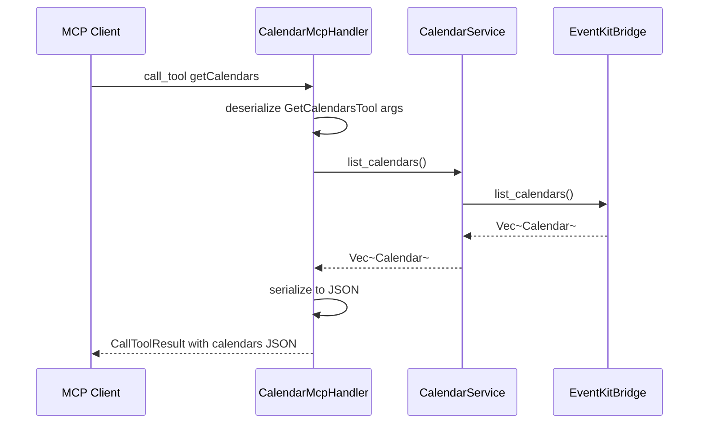
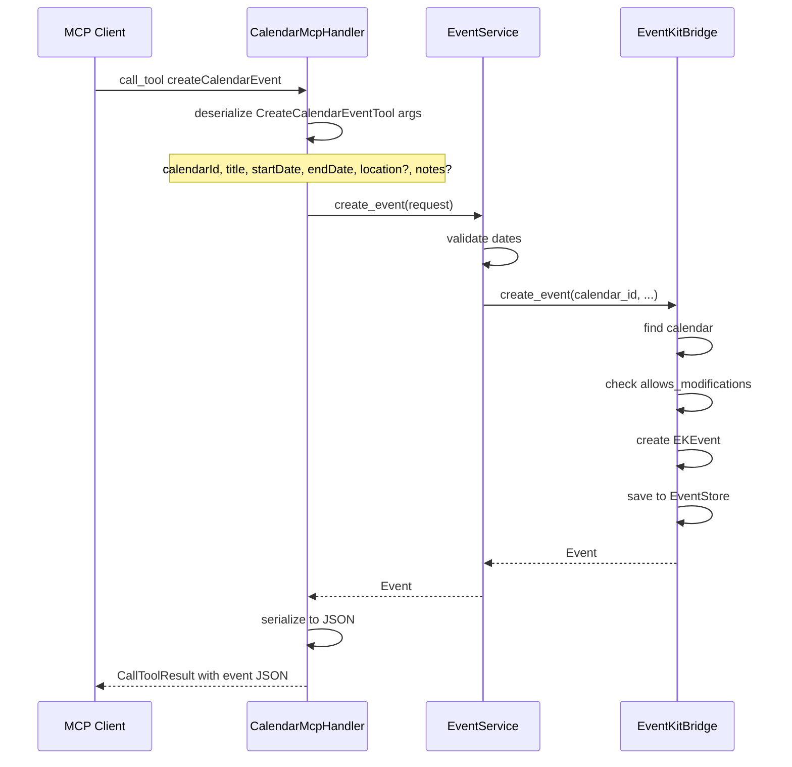

# Spec 06: MCP Tools — определение и реализация

**Metadata:**
- Priority: 6
- Status: Done
- Effort: L (>20 min)

## Overview
### Problem Statement
Необходимо определить 7 MCP tools для работы с календарями и событиями macOS, аналогичных tools из оригинального проекта `mcp-apple-calendar`. Каждый tool должен иметь схему параметров, описание и обработчик.

### Solution Summary
Использовать макрос `#[tool]` из `rmcp` (https://github.com/modelcontextprotocol/rust-sdk) для декларативного определения tools с автоматической генерацией JSON Schema. Каждый tool описан в модуле `src/tools/`. Calendar tools в `src/tools/calendar.rs`, event tools в `src/tools/event.rs`.

## Data Model

```mermaid
classDiagram
    class GetCalendarsTool {
        <<tool>>
        name: getCalendars
        description: List all available macOS calendars
        params: none
    }
    class GetCalendarEventsTool {
        <<tool>>
        name: getCalendarEvents
        description: Get events from a specific calendar
        params: calendarId: String
    }
    class CreateCalendarTool {
        <<tool>>
        name: createCalendar
        description: Create a new calendar
        params: title: String, color?: String
    }
    class DeleteCalendarTool {
        <<tool>>
        name: deleteCalendar
        description: Delete a calendar
        params: calendarId: String
    }
    class CreateCalendarEventTool {
        <<tool>>
        name: createCalendarEvent
        description: Create a new event in a calendar
        params: calendarId, title, startDate, endDate, location?, notes?
    }
    class UpdateCalendarEventTool {
        <<tool>>
        name: updateCalendarEvent
        description: Update an existing event
        params: calendarId, eventId, title?, startDate?, endDate?, location?, notes?
    }
    class DeleteCalendarEventTool {
        <<tool>>
        name: deleteCalendarEvent
        description: Delete an event from a calendar
        params: calendarId, eventId
    }
```


## Diagrams
### Sequence Diagram — getCalendars


### Sequence Diagram — createCalendarEvent


## Requirements
### R1: Tool getCalendars
- **Имя**: `getCalendars`
- **Описание**: `List all available macOS calendars`
- **Параметры**: нет
- **Вызов**: `CalendarService::list_calendars()`
- **Ответ**: `{"calendars": [...]}`
- **Ошибка**: `{"error": "Failed to get calendars"}`

### R2: Tool getCalendarEvents
- **Имя**: `getCalendarEvents`
- **Описание**: `Get events from a specific calendar`
- **Параметры**:
  - `calendarId: String` — ID календаря, обязательный
- **Вызов**: `EventService::list_events(calendar_id)`
- **Ответ**: `{"events": [...]}`
- **Ошибка**: `{"error": "Failed to get events from calendar: {calendarId}"}`

### R3: Tool createCalendar
- **Имя**: `createCalendar`
- **Описание**: `Create a new calendar in macOS`
- **Параметры**:
  - `title: String` — название календаря, обязательный
  - `color: Option<String>` — цвет в hex формате, опциональный
- **Вызов**: `CalendarService::create_calendar(title, color)`
- **Ответ**: `{"success": true, "message": "Calendar created", "calendar": {...}}`
- **Ошибка**: `{"error": "Failed to create calendar"}`

### R4: Tool deleteCalendar
- **Имя**: `deleteCalendar`
- **Описание**: `Delete a calendar from macOS`
- **Параметры**:
  - `calendarId: String` — ID календаря, обязательный
- **Вызов**: `CalendarService::delete_calendar(calendar_id)`
- **Ответ**: `{"success": true, "message": "Calendar deleted"}`
- **Ошибка**: `{"error": "Failed to delete calendar"}`

### R5: Tool createCalendarEvent
- **Имя**: `createCalendarEvent`
- **Описание**: `Create a new event in a calendar`
- **Параметры**:
  - `calendarId: String` — ID календаря, обязательный
  - `title: String` — название события, обязательный
  - `startDate: String` — дата начала в ISO8601, обязательный
  - `endDate: String` — дата окончания в ISO8601, обязательный
  - `location: Option<String>` — место проведения, опциональный
  - `notes: Option<String>` — заметки, опциональный
- **Вызов**: `EventService::create_event(request)`
- **Ответ**: `{"success": true, "message": "Event created", "event": {...}}`
- **Ошибка**: `{"error": "Failed to create event", "details": "..."}`

### R6: Tool updateCalendarEvent
- **Имя**: `updateCalendarEvent`
- **Описание**: `Update an existing event in a calendar`
- **Параметры**:
  - `calendarId: String` — ID календаря, обязательный
  - `eventId: String` — ID события, обязательный
  - `title: Option<String>` — новое название, опциональный
  - `startDate: Option<String>` — новая дата начала, опциональный
  - `endDate: Option<String>` — новая дата окончания, опциональный
  - `location: Option<String>` — новое место, опциональный
  - `notes: Option<String>` — новые заметки, опциональный
- **Вызов**: `EventService::update_event(request)`
- **Ответ**: `{"success": true, "message": "Event updated", "event": {...}}`
- **Ошибка**: `{"error": "Failed to update event", "details": "..."}`

### R7: Tool deleteCalendarEvent
- **Имя**: `deleteCalendarEvent`
- **Описание**: `Delete an event from a calendar`
- **Параметры**:
  - `calendarId: String` — ID календаря, обязательный
  - `eventId: String` — ID события, обязательный
- **Вызов**: `EventService::delete_event(calendar_id, event_id)`
- **Ответ**: `{"success": true, "message": "Event deleted"}`
- **Ошибка**: `{"error": "Failed to delete event"}`

### R8: Определение структур tools через макрос
Каждый tool определяется через `#[tool]` макрос:

```rust
// src/tools/calendar.rs
#[tool(name = "getCalendars", description = "List all available macOS calendars")]
#[derive(Debug, Deserialize, Serialize, JsonSchema)]
pub struct GetCalendarsTool {}

#[tool(name = "getCalendarEvents", description = "Get events from a specific calendar")]
#[derive(Debug, Deserialize, Serialize, JsonSchema)]
pub struct GetCalendarEventsTool {
    /// The ID of the calendar to get events from
    pub calendar_id: String,
}

#[tool(name = "createCalendar", description = "Create a new calendar in macOS")]
#[derive(Debug, Deserialize, Serialize, JsonSchema)]
pub struct CreateCalendarTool {
    /// The title of the calendar
    pub title: String,
    /// The color of the calendar in hex format, e.g. #FF0000
    pub color: Option<String>,
}

#[tool(name = "deleteCalendar", description = "Delete a calendar from macOS")]
#[derive(Debug, Deserialize, Serialize, JsonSchema)]
pub struct DeleteCalendarTool {
    /// The ID of the calendar to delete
    pub calendar_id: String,
}

// src/tools/event.rs
#[tool(name = "createCalendarEvent", description = "Create a new event in a calendar")]
#[derive(Debug, Deserialize, Serialize, JsonSchema)]
pub struct CreateCalendarEventTool {
    /// The ID of the calendar to create the event in
    pub calendar_id: String,
    /// The title of the event
    pub title: String,
    /// Start date in ISO8601 format, e.g. 2025-03-09T10:00:00.000Z
    pub start_date: String,
    /// End date in ISO8601 format, e.g. 2025-03-09T11:00:00.000Z
    pub end_date: String,
    /// Location of the event
    pub location: Option<String>,
    /// Notes for the event
    pub notes: Option<String>,
}

#[tool(name = "updateCalendarEvent", description = "Update an existing event in a calendar")]
#[derive(Debug, Deserialize, Serialize, JsonSchema)]
pub struct UpdateCalendarEventTool {
    /// The ID of the calendar the event belongs to
    pub calendar_id: String,
    /// The ID of the event to update
    pub event_id: String,
    /// New title for the event
    pub title: Option<String>,
    /// New start date in ISO8601 format
    pub start_date: Option<String>,
    /// New end date in ISO8601 format
    pub end_date: Option<String>,
    /// New location for the event
    pub location: Option<String>,
    /// New notes for the event
    pub notes: Option<String>,
}

#[tool(name = "deleteCalendarEvent", description = "Delete an event from a calendar")]
#[derive(Debug, Deserialize, Serialize, JsonSchema)]
pub struct DeleteCalendarEventTool {
    /// The ID of the calendar the event belongs to
    pub calendar_id: String,
    /// The ID of the event to delete
    pub event_id: String,
}
```

### R9: Регистрация всех tools в handler
В `handle_list_tools_request` вернуть вектор всех 7 tools:
```rust
Ok(ListToolsResult {
    tools: vec![
        GetCalendarsTool::tool(),
        GetCalendarEventsTool::tool(),
        CreateCalendarTool::tool(),
        DeleteCalendarTool::tool(),
        CreateCalendarEventTool::tool(),
        UpdateCalendarEventTool::tool(),
        DeleteCalendarEventTool::tool(),
    ],
    meta: None,
    next_cursor: None,
})
```

## Acceptance Criteria
- [x] S06AC1: Все 7 tools определены через `#[tool]` макрос
- [x] S06AC2: Каждый tool имеет корректное имя, описание и схему параметров
- [x] S06AC3: `getCalendars` вызывается без параметров и возвращает список календарей
- [x] S06AC4: `getCalendarEvents` принимает `calendarId` и возвращает события
- [x] S06AC5: `createCalendar` создаёт календарь с обязательным title и опциональным color
- [x] S06AC6: `deleteCalendar` удаляет календарь по ID
- [x] S06AC7: `createCalendarEvent` создаёт событие с валидацией дат
- [x] S06AC8: `updateCalendarEvent` обновляет только переданные поля
- [x] S06AC9: `deleteCalendarEvent` удаляет событие по calendarId и eventId
- [x] S06AC10: Все tools возвращают ошибки в формате JSON с `is_error: true`
- [x] S06AC11: JSON Schema параметров корректно генерируется для каждого tool

## Implementation Notes
- `CalendarMcpHandler` теперь хранит `EventKitBridge` через `Mutex<Option<EventKitBridge>>` для thread-safety.
- Добавлен `unsafe impl Send/Sync for EventKitBridge` — EKEventStore потокобезопасен при правильном использовании (защищён Mutex).
- `dispatch_tool` сначала валидирует имя tool, затем проверяет bridge — это позволяет корректно возвращать `unknown_tool` ошибку даже без bridge.
- `execute()` методы tools принимают `&EventKitBridge` и вызывают соответствующие сервисы (`CalendarService`, `EventService`).
- Интеграция с `main.rs` обновлена: bridge создаётся при запуске, запрашивается доступ, передаётся в handler.
- Все 65 тестов проходят (включая 10 новых для spec-06).
