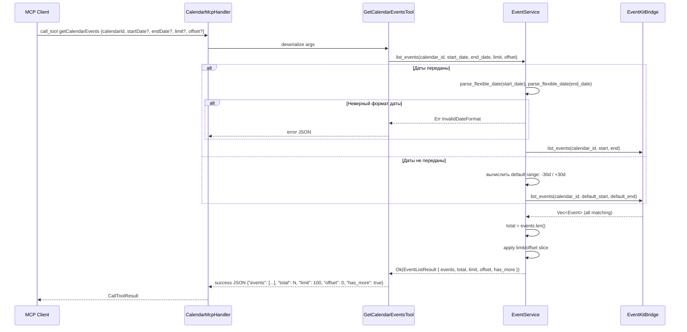

# Spec 09: Параметры-фильтры по дате и пагинация для getCalendarEvents

**Metadata:**
- Priority: 9
- Status: Done
- Effort: M (10-20 min)

## Overview
### Problem Statement
MCP tool `getCalendarEvents` возвращает события календаря за захардкоженный диапазон -30/+30 дней от текущего момента. Нет возможности получить события за конкретный день или произвольный диапазон дат. Также отсутствует пагинация — при большом количестве событий ответ может быть слишком объёмным. MCP-клиент не может запросить «все события на сегодня» или «события с 1 по 15 мая», а также не может ограничить количество возвращаемых событий.

### Solution Summary
Добавить опциональные параметры `startDate`, `endDate` для фильтрации по дате и `limit`, `offset` для пагинации в `GetCalendarEventsTool`. По умолчанию лимит — 100 событий. Bridge-слой ([`EventKitBridge::list_events()`](src/bridge/eventkit.rs:302)) уже принимает `start`/`end`, пагинация применяется на уровне сервисного слоя после получения данных от EventKit. Ответ дополняется метаданными пагинации (`total`, `limit`, `offset`, `has_more`).

## Diagrams
### Sequence Diagram — getCalendarEvents с фильтром по дате и пагинацией


## Requirements
### R1: Обновление структуры GetCalendarEventsTool
В [`src/tools/calendar.rs`](src/tools/calendar.rs:52) добавить опциональные параметры:

```rust
#[tool(name = "getCalendarEvents", description = "Get events from a specific calendar, optionally filtered by date range with pagination")]
#[derive(Debug, Deserialize, Serialize, JsonSchema)]
pub struct GetCalendarEventsTool {
    /// The ID of the calendar to get events from
    pub calendar_id: String,
    /// Start date for filtering events in ISO8601 format, e.g. 2025-03-09T00:00:00. If not provided, defaults to 30 days ago
    pub start_date: Option<String>,
    /// End date for filtering events in ISO8601 format, e.g. 2025-03-09T23:59:59. If not provided, defaults to 30 days from now
    pub end_date: Option<String>,
    /// Maximum number of events to return. Defaults to 100
    pub limit: Option<u32>,
    /// Number of events to skip for pagination. Defaults to 0
    pub offset: Option<u32>,
}
```

- Все параметры кроме `calendar_id` опциональные — обратная совместимость сохраняется
- Формат дат — ISO8601, те же форматы что и в [`parse_flexible_date()`](src/models.rs) (см. spec-03 R5)
- Описание tool обновить: `"Get events from a specific calendar, optionally filtered by date range with pagination"`

### R2: Модель ответа с пагинацией
В [`src/models.rs`](src/models.rs) добавить структуру:

```rust
#[derive(Debug, Clone, Serialize, Deserialize)]
pub struct EventListResult {
    pub events: Vec<Event>,
    pub total: usize,
    pub limit: u32,
    pub offset: u32,
    pub has_more: bool,
}
```

- `total` — общее количество событий, соответствующих фильтру (до применения пагинации)
- `limit` — фактически использованный лимит
- `offset` — фактически использованный offset
- `has_more` — `true` если `offset + limit < total`

### R3: Обновление EventService::list_events
В [`src/services/event_service.rs`](src/services/event_service.rs:25) изменить сигнатуру:

```rust
pub fn list_events(
    &self,
    calendar_id: &str,
    start_date: Option<&str>,
    end_date: Option<&str>,
    limit: Option<u32>,
    offset: Option<u32>,
) -> ServiceResult<EventListResult>
```

Логика:
1. Валидация `calendar_id` не пустой (существующая проверка)
2. Если `start_date` передан — распарсить через `parse_flexible_date()`, иначе использовать `now - 30 days`
3. Если `end_date` передан — распарсить через `parse_flexible_date()`, иначе использовать `now + 30 days`
4. Если передан только один из параметров — второй вычислить по умолчанию
5. Валидация: `start_date` должен быть раньше `end_date`
6. Вызвать `self.bridge.list_events(calendar_id, &start_str, &end_str)` → получить все события
7. Применить пагинацию:
   - `limit` по умолчанию = `10`, максимум = `1000`
   - `offset` по умолчанию = `0`
   - Валидация: `limit` > 0, `offset` >= 0
   - `total = events.len()`
   - Срезать `events[offset..offset+limit]`
   - `has_more = (offset + limit) < total`
8. Вернуть `EventListResult`

### R4: Обновление GetCalendarEventsTool::execute
В [`src/tools/calendar.rs`](src/tools/calendar.rs:59) передать все параметры в сервис:

```rust
impl GetCalendarEventsTool {
    pub fn execute(&self, bridge: &EventKitBridge) -> Result<CallToolResult, CallToolError> {
        let service = crate::services::event_service::EventService::new(bridge);
        match service.list_events(
            &self.calendar_id,
            self.start_date.as_deref(),
            self.end_date.as_deref(),
            self.limit,
            self.offset,
        ) {
            Ok(result) => Ok(success_json(&serde_json::to_value(result).unwrap())),
            Err(e) => Ok(error_json(&format!(
                "Failed to get events from calendar: {}",
                e
            ))),
        }
    }
}
```

### R5: Обратная совместимость
- Вызов `getCalendarEvents` без `startDate`/`endDate`/`limit`/`offset` возвращает до 10 событий за диапазон -30/+30 дней
- Существующие MCP-клиенты не требуют изменений
- JSON Schema параметров корректно отражает все параметры как optional
- Формат ответа расширен: добавлены поля `total`, `limit`, `offset`, `has_more` на верхнем уровне

### R6: Валидация дат
- При передаче невалидного формата `startDate` или `endDate` — вернуть ошибку `InvalidDateFormat` с перечислением поддерживаемых форматов
- При передаче `startDate` позже `endDate` — вернуть ошибку валидации `"start_date must be before end_date"`
- Парсинг дат через существующую функцию [`parse_flexible_date()`](src/models.rs)

### R7: Валидация пагинации
- `limit` по умолчанию = `10` (если не передан)
- `limit` максимум = `1000` — при превышении вернуть ошибку валидации `"limit must not exceed 1000"`
- `limit` минимум = `1` — при передаче `0` вернуть ошибку валидации `"limit must be at least 1"`
- `offset` по умолчанию = `0` (если не передан)
- `offset` не может превышать `total` — если `offset >= total`, вернуть пустой список событий с `has_more: false`

## Acceptance Criteria
- [x] S09AC1: `GetCalendarEventsTool` принимает опциональные параметры `startDate`, `endDate`, `limit`, `offset`
- [x] S09AC2: Вызов `getCalendarEvents` с `calendarId` + `startDate` + `endDate` возвращает события только за указанный диапазон
- [x] S09AC3: Вызов `getCalendarEvents` только с `calendarId` (без дат и пагинации) возвращает до 10 событий за диапазон -30/+30 дней (обратная совместимость)
- [x] S09AC4: Вызов с `startDate` но без `endDate` использует `startDate` как начало и `now + 30d` как конец
- [x] S09AC5: Вызов с `endDate` но без `startDate` использует `now - 30d` как начало и `endDate` как конец
- [x] S09AC6: Передача невалидного формата даты возвращает ошибку `InvalidDateFormat`
- [x] S09AC7: Передача `startDate` позже `endDate` возвращает ошибку валидации
- [x] S09AC8: JSON Schema tool'а корректно отображает все 4 параметра как optional
- [x] S09AC9: По умолчанию `limit` = 100 — возвращается не более 100 событий
- [x] S09AC10: Передача `limit: 50, offset: 0` возвращает первые 50 событий, `has_more: true` если всего > 50
- [x] S09AC11: Передача `limit: 50, offset: 50` возвращает следующие 50 событий (вторая страница)
- [x] S09AC12: Передача `limit: 0` возвращает ошибку валидации `"limit must be at least 1"`
- [x] S09AC13: Передача `limit` > 1000 возвращает ошибку валидации `"limit must not exceed 1000"`
- [x] S09AC14: Ответ содержит поля `total`, `limit`, `offset`, `has_more` на верхнем уровне рядом с `events`
- [x] S09AC15: При `offset >= total` возвращается пустой список `events: []` с `has_more: false`

## Implementation Notes
- Диапазон по умолчанию изменён с -30/+365 дней на -30/+30 дней (по спецификации).
- Добавлена структура `EventListResult` в `src/models.rs` с полями `events`, `total`, `limit`, `offset`, `has_more`.
- Сигнатура `EventService::list_events()` расширена: добавлены параметры `start_date`, `end_date`, `limit`, `offset`.
- Константы `DEFAULT_LIMIT=100` и `MAX_LIMIT=1000` определены в `src/services/event_service.rs`.
- Тесты AC2-AC7, AC9-AC15 реализованы как unit-тесты без зависимости от EventKitBridge (не требуют main thread).
- Тесты AC1, AC8 проверяют JSON Schema через `#[tool]` макрос.
