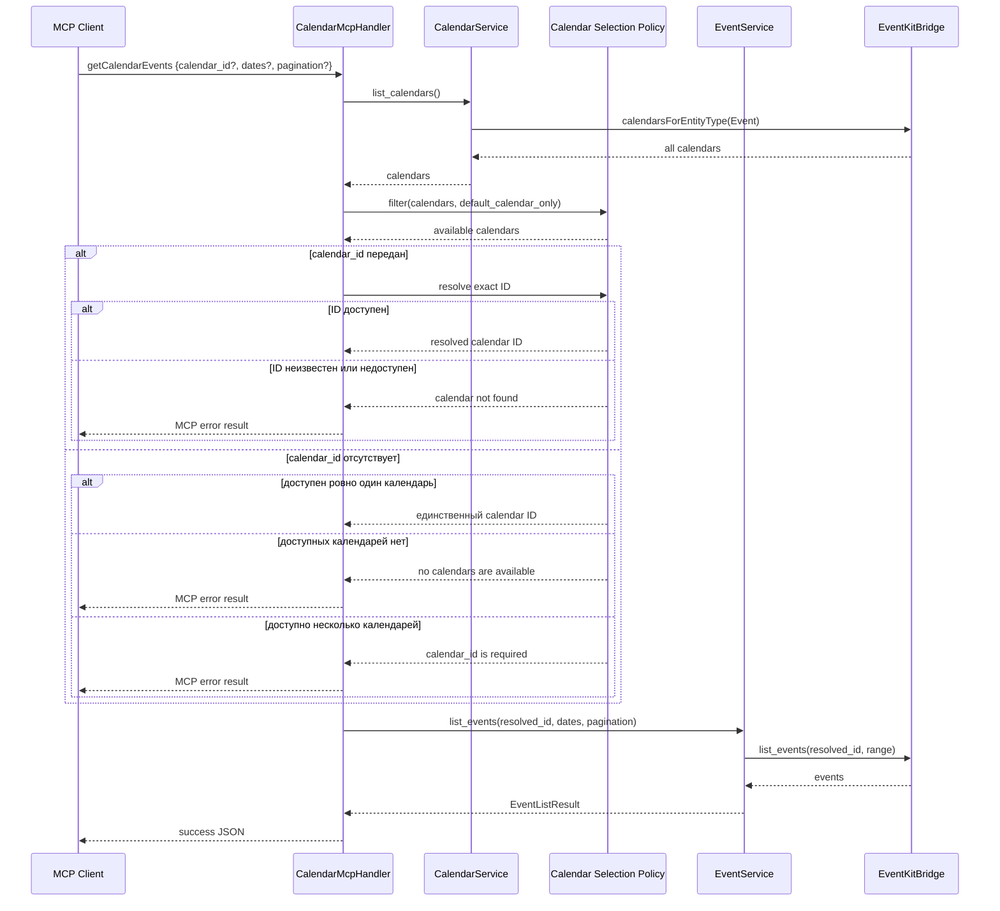

# Spec 10: Режим default-календаря и опциональный `calendar_id`

**Metadata:**
- Priority: 10
- Status: Done
- Effort: M (10-20 min)

## Overview
### Problem Statement
MCP-клиент обязан передавать `calendar_id` в каждом вызове `getCalendarEvents`, даже когда сервер предоставляет только один доступный календарь. Для LLM-клиентов это создаёт лишний шаг `getCalendars` и риск ошибки при копировании длинного UUID. Также сервер нельзя запустить в режиме, в котором read-инструменты видят только системный календарь с `is_default: true`.

### Solution Summary
Добавить CLI-флаг `--default-calendar-only`. В этом режиме множество доступных календарей для `getCalendars` и `getCalendarEvents` ограничивается календарями с `is_default: true`. Сделать `calendar_id` опциональным параметром `getCalendarEvents`: когда параметр отсутствует и после применения текущей политики доступен ровно один календарь, сервер выбирает его автоматически. При нуле или нескольких доступных календарях сервер возвращает однозначную ошибку и не выбирает календарь эвристически.

Обновить MCP JSON Schema и описания инструментов так, чтобы клиент видел `calendar_id` как optional и понимал условия автоматического выбора. Явно переданный UUID всегда проверяется точно; ошибочный UUID не заменяется единственным доступным календарём.

## Requirements
### R1: CLI-флаг `--default-calendar-only`
- Добавить boolean-флаг `--default-calendar-only` в `CliArgs`; значение по умолчанию — `false`.
- Добавить `default_calendar_only: bool` в `ServerConfig` и передавать его в `CalendarMcpHandler` для stdio, SSE и Streamable HTTP transport.
- Флаг должен независимо комбинироваться с `--read-only`.
- При включённом флаге сервер должен логировать `"Default-calendar-only mode enabled"` на уровне `info`.
- Без флага набор доступных календарей и поведение существующих вызовов с `calendar_id` не меняются.

### R2: Политика доступных календарей для read-инструментов
- При `default_calendar_only == false` доступными считаются все календари, возвращённые EventKit.
- При `default_calendar_only == true` доступными считаются только календари с `is_default == true`.
- `getCalendars` должен возвращать список после применения этой политики.
- Если EventKit не возвращает default-календарь, `getCalendars` в режиме `--default-calendar-only` успешно возвращает `{"calendars": []}`.
- Политика должна вычисляться из актуального результата EventKit, а не из захардкоженного или однажды сохранённого UUID.

### R3: Разрешение календаря в `getCalendarEvents`
- Изменить входной тип `calendar_id` с `String` на `Option<String>`.
- Если `calendar_id` передан, использовать только точное совпадение среди доступных календарей.
- Если передан неизвестный или недоступный UUID, сохранить ошибку `calendar not found: {id}`; нельзя автоматически подставлять единственный доступный календарь.
- Если передано пустое или состоящее из пробелов значение, вернуть `calendar_id must not be empty`.
- Если `calendar_id` отсутствует и доступен ровно один календарь, автоматически использовать его ID.
- Если `calendar_id` отсутствует и доступных календарей нет, вернуть ошибку `no calendars are available`.
- Если `calendar_id` отсутствует и доступны два или более календаря, вернуть ошибку `calendar_id is required when multiple calendars are available`.
- Разрешённый ID должен быть передан в существующую логику фильтрации дат и пагинации без изменения её семантики.

### R4: Обновление MCP-параметров и описаний
- JSON Schema `getCalendarEvents` не должна включать `calendar_id` в массив `required`.
- Свойство `calendar_id` должно оставаться в `properties` с описанием: `Optional when exactly one calendar is available; otherwise required`.
- Описание `getCalendarEvents` должно сообщать, что сервер автоматически выбирает календарь только при единственном доступном календаре.
- Описание `getCalendars` должно сообщать, что возвращается набор календарей, доступный согласно режиму запуска сервера.
- Параметры `start_date`, `end_date`, `limit` и `offset`, а также формат успешного ответа остаются без изменений.
- Десериализация `{}` и объекта только с датами/пагинацией должна успешно создавать `GetCalendarEventsParams` с `calendar_id: None`.

### R5: Границы ответственности handler и service
- Выбор доступного календаря должен происходить до вызова `EventService::list_events`, чтобы сервис по-прежнему получал конкретный непустой ID.
- Логика определения единственного календаря должна быть общей для stdio, SSE и Streamable HTTP, без расхождений между transport.
- Ошибки выбора календаря должны возвращаться как MCP error result в существующем JSON-формате `{"error": "..."}`.
- Ошибка выбора календаря не должна инициировать запрос событий ко всем календарям.

### R6: Обратная совместимость и scope
- При выключенном флаге вызов с корректным явным `calendar_id` должен работать как до изменения.
- При выключенном флаге вызов без `calendar_id` разрешён только когда EventKit возвращает ровно один календарь.
- При включённом флаге и наличии одного default-календаря вызов без `calendar_id` должен работать независимо от общего количества недефолтных календарей EventKit.
- В этой спецификации политика `--default-calendar-only` применяется к `getCalendars` и `getCalendarEvents`.
- Параметры и правила `createCalendar`, `deleteCalendar`, `createCalendarEvent`, `updateCalendarEvent` и `deleteCalendarEvent` не меняются; для календарных mutation-инструментов `calendar_id` остаётся обязательным.

### R7: Документация и тестирование
- Обновить README: добавить пример запуска `--default-calendar-only`, совместное использование с `--read-only` и пример `getCalendarEvents` без `calendar_id`.
- Добавить unit-тесты CLI parsing и передачи флага в `ServerConfig`/handler.
- Добавить тесты политики для нуля, одного и нескольких доступных календарей, а также режима только default-календаря.
- Добавить тесты JSON Schema и десериализации обновлённых MCP-параметров.
- Тесты выбора календаря должны использовать test double и не зависеть от Calendar permission или запуска на macOS main thread.

## Diagrams
### Sequence Diagram

## Acceptance Criteria
- [x] S10AC1: CLI-флаг `--default-calendar-only` парсится, по умолчанию равен `false`, комбинируется с `--read-only`, передаётся в handler для всех transport и при включении логирует `Default-calendar-only mode enabled`.
- [x] S10AC2: При `--default-calendar-only` `getCalendars` возвращает только календари с `is_default: true`; без флага возвращается полный доступный список.
- [x] S10AC3: При `--default-calendar-only` и отсутствии default-календаря `getCalendars` возвращает `{"calendars": []}`.
- [x] S10AC4: `GetCalendarEventsParams` успешно десериализуется из `{}` и из объекта только с датами/пагинацией без `calendar_id`, а JSON Schema не содержит `calendar_id` в `required`.
- [x] S10AC5: Вызов `getCalendarEvents` без `calendar_id` при единственном доступном календаре использует ID этого календаря и возвращает его события.
- [x] S10AC6: Вызов без `calendar_id` при нескольких доступных календарях возвращает `calendar_id is required when multiple calendars are available` и не вызывает EventKit event query.
- [x] S10AC7: Вызов без `calendar_id` при отсутствии доступных календарей возвращает `no calendars are available` и не вызывает EventKit event query.
- [x] S10AC8: При включённом `--default-calendar-only` и одном default-календаре `calendar_id` можно не указывать, даже если EventKit содержит другие недефолтные календари.
- [x] S10AC9: Явно переданный корректный `calendar_id` продолжает работать без изменения дат, пагинации и формата ответа.
- [x] S10AC10: Явно переданный ошибочный или недоступный ID возвращает `calendar not found: {id}` и не заменяется единственным доступным календарём.
- [x] S10AC11: Значение `calendar_id: ""` или только из пробелов возвращает `calendar_id must not be empty`.
- [x] S10AC12: Описание `getCalendarEvents` и schema property сообщают, что `calendar_id` опционален только при единственном доступном календаре; описание `getCalendars` отражает текущую политику доступности.
- [x] S10AC13: README содержит конфигурации `--default-calendar-only`, `--default-calendar-only --read-only` и пример `getCalendarEvents` без `calendar_id`.
- [x] S10AC14: `cargo test` проходит без необходимости предоставлять тестовому процессу доступ к macOS Calendar.
- [x] S10AC15: Если default-календарь меняется между двумя вызовами, следующий вызов использует актуальный результат EventKit, а не ранее сохранённый UUID.
- [x] S10AC16: Все ошибки выбора календаря возвращаются как MCP error result с JSON `{"error": "..."}` и одинаковым поведением в stdio, SSE и Streamable HTTP.
- [x] S10AC17: MCP-схемы пяти mutation-инструментов остаются без изменений; `calendar_id` остаётся обязательным в тех mutation-инструментах, где он обязателен сейчас.

## Implementation Notes
- Политика доступности и разрешения `calendar_id` реализована в handler до вызова `EventService::list_events`; test double проверяет ветви выбора без доступа к EventKit и macOS Calendar permission.
- Список календарей запрашивается заново для каждого read-вызова, поэтому default-календарь не кэшируется и может изменяться во время работы сервера.
- Пять существующих EventKit-тестов помечены как требующие отдельного macOS main-thread/TCC harness; остальные unit- и integration-тесты проходят без Calendar permission.
