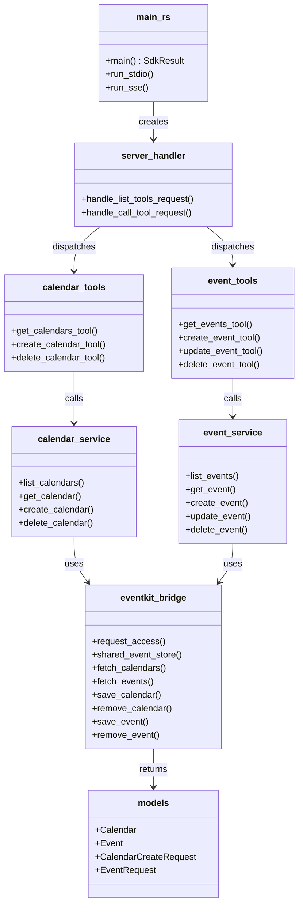
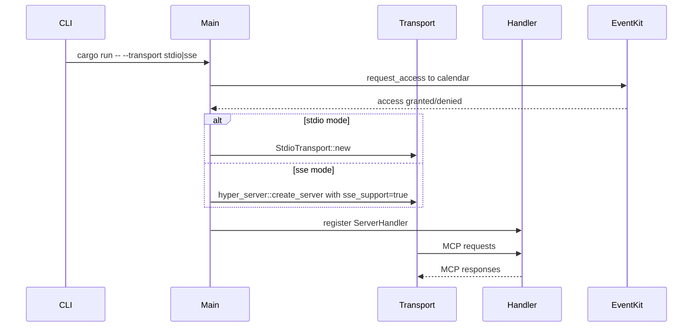

# Spec 01: Настройка проекта и архитектура

**Metadata:**
- Priority: 1
- Status: Draft
- Effort: L (>20 min)

## Overview
### Problem Statement
Необходимо создать Rust проект для MCP сервера, обеспечивающего доступ к календарю macOS. Проект должен поддерживать два режима транспорта: stdio и SSE/HTTP. Требуется определить архитектуру, зависимости и структуру модулей.

### Solution Summary
Создать Cargo проект с использованием `rust-mcp-sdk` для MCP протокола и `objc2`/`icrate` для доступа к macOS EventKit через нативные Objective-C bindings. Проект разделить на слои: транспорт, MCP handler, бизнес-логика календаря, EventKit bridge.

## Data Model

## Diagrams
### Sequence Diagram — Запуск сервера

## Requirements
### R1: Структура проекта Cargo
- Создать binary crate `mcp-macos-calendar`
- Workspace структура с отдельными модулями:
  - `src/main.rs` — точка входа, парсинг CLI аргументов
  - `src/server.rs` — MCP ServerHandler реализация
  - `src/tools/calendar.rs` — MCP tools для календарей
  - `src/tools/event.rs` — MCP tools для событий
  - `src/tools/mod.rs` — реэкспорт tools
  - `src/services/calendar_service.rs` — бизнес-логика календарей
  - `src/services/event_service.rs` — бизнес-логика событий
  - `src/services/mod.rs` — реэкспорт сервисов
  - `src/bridge/eventkit.rs` — EventKit FFI bridge через objc2/icrate
  - `src/bridge/mod.rs` — реэкспорт bridge
  - `src/models.rs` — структуры данных Calendar, Event, request/response
  - `src/error.rs` — кастомные ошибки
  - `src/config.rs` — конфигурация сервера

### R2: Зависимости Cargo.toml
- `rust-mcp-sdk` — MCP протокол, поддержка stdio и SSE/HTTP транспорта
- `objc2` — Rust bindings для Objective-C runtime
- `icrate` с feature `EventKit` — автогенерированные bindings для Apple EventKit
- `tokio` с features `full` — async runtime
- `serde` + `serde_json` — сериализация/десериализация
- `chrono` — работа с датами
- `clap` с feature `derive` — парсинг CLI аргументов
- `tracing` + `tracing-subscriber` — логирование
- `thiserror` — derive макрос для ошибок

### R3: CLI аргументы
- `--transport` — тип транспорта: `stdio` по умолчанию или `sse`
- `--port` — порт для SSE режима, по умолчанию `8080`
- `--host` — хост для SSE режима, по умолчанию `127.0.0.1`
- `--log-level` — уровень логирования, по умолчанию `info`

### R4: Конфигурация SSE сервера
- Endpoint для Streamable HTTP: `http://{host}:{port}/mcp`
- Endpoint для SSE: `http://{host}:{port}/sse`
- Включить `sse_support: true` для обратной совместимости
- Включить `dns_rebinding_protection: true`
- Использовать `InMemoryEventStore` для resumability

### R5: Сборка только для macOS
- В `Cargo.toml` указать `target = "aarch64-apple-darwin"` и `x86_64-apple-darwin`
- Использовать conditional compilation `#[cfg(target_os = "macos")]`
- Добавить build script при необходимости для линковки macOS фреймворков

## Acceptance Criteria
- [ ] S01AC1: Проект компилируется командой `cargo build` на macOS
- [ ] S01AC2: `cargo run -- --transport stdio` запускает MCP сервер в stdio режиме
- [ ] S01AC3: `cargo run -- --transport sse --port 3000` запускает MCP сервер с SSE на порту 3000
- [ ] S01AC4: Структура файлов проекта соответствует R1
- [ ] S01AC5: Все зависимости из R2 добавлены в Cargo.toml
- [ ] S01AC6: CLI аргументы из R3 корректно парсятся
