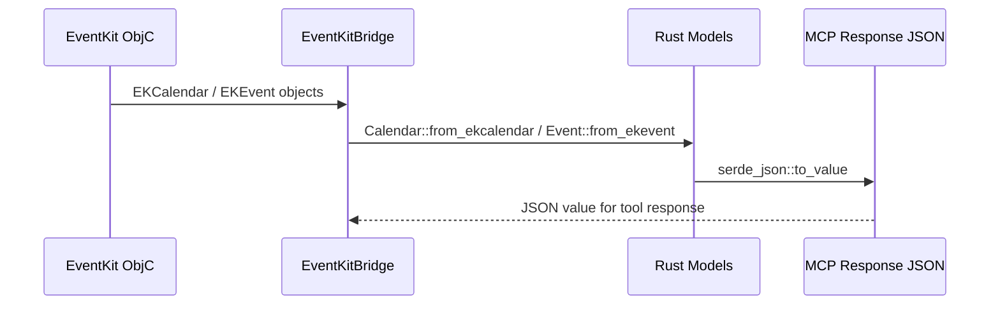

# Spec 03: Модели данных и сериализация

**Metadata:**
- Priority: 3
- Status: Draft
- Effort: M (10-20 min)

## Overview
### Problem Statement
Необходимо определить Rust структуры данных для календарей и событий, которые будут использоваться как для взаимодействия с EventKit, так и для сериализации в JSON ответы MCP tools. Модели должны быть совместимы с форматами оригинальных проектов.

### Solution Summary
Определить модели в модуле `src/models.rs` с использованием `serde` для JSON сериализации. Структуры должны отражать данные из EventKit и одновременно служить DTO для MCP ответов.

## Diagrams
### Sequence Diagram — Преобразование данных


## Requirements
### R1: Модель Calendar
```rust
#[derive(Debug, Clone, Serialize, Deserialize)]
pub struct Calendar {
    pub id: String,
    pub title: String,
    pub color: String,        // hex format: #RRGGBB
    pub is_default: bool,
    pub allows_modifications: bool,
}
```
- Поле `id` соответствует `calendarIdentifier` из EKCalendar
- Поле `color` — hex представление CGColor
- Поле `is_default` — сравнение с `defaultCalendarForNewEvents`
- Реализовать метод `from_ekcalendar` для конвертации из ObjC объекта

### R2: Модель Event
```rust
#[derive(Debug, Clone, Serialize, Deserialize)]
pub struct Event {
    pub id: String,
    pub title: String,
    pub start_date: String,    // ISO8601
    pub end_date: String,      // ISO8601
    pub is_all_day: bool,
    pub location: Option<String>,
    pub notes: Option<String>,
    pub url: Option<String>,
    pub calendar_id: String,
}
```
- Даты хранятся как ISO8601 строки
- Реализовать метод `from_ekevent` для конвертации из ObjC объекта

### R3: Request модели
```rust
#[derive(Debug, Deserialize)]
pub struct CalendarCreateRequest {
    pub title: String,
    pub color: Option<String>,
}

#[derive(Debug, Deserialize)]
pub struct EventCreateRequest {
    pub calendar_id: String,
    pub title: String,
    pub start_date: String,
    pub end_date: String,
    pub is_all_day: Option<bool>,
    pub location: Option<String>,
    pub notes: Option<String>,
    pub url: Option<String>,
}

#[derive(Debug, Deserialize)]
pub struct EventUpdateRequest {
    pub calendar_id: String,
    pub event_id: String,
    pub title: Option<String>,
    pub start_date: Option<String>,
    pub end_date: Option<String>,
    pub is_all_day: Option<bool>,
    pub location: Option<String>,
    pub notes: Option<String>,
    pub url: Option<String>,
}
```

### R4: MCP Tool response модели
```rust
#[derive(Debug, Serialize)]
pub struct ToolResponse<T: Serialize> {
    pub success: bool,
    #[serde(skip_serializing_if = "Option::is_none")]
    pub data: Option<T>,
    #[serde(skip_serializing_if = "Option::is_none")]
    pub message: Option<String>,
    #[serde(skip_serializing_if = "Option::is_none")]
    pub error: Option<String>,
}
```

### R5: Валидация дат
- Создать helper функцию `parse_flexible_date(input: &str) -> Result<NaiveDateTime>`
- Поддерживаемые форматы:
  - `2025-03-09T10:00:00.000Z` — ISO8601 с миллисекундами и UTC
  - `2025-03-09T10:00:00` — ISO8601 без миллисекунд
  - `2025-03-09 10:00:00` — с пробелом вместо T
- Использовать `chrono` для парсинга
- Возвращать осмысленную ошибку при невалидном формате

## Acceptance Criteria
- [ ] S03AC1: `Calendar` сериализуется в JSON с полями id, title, color, is_default, allows_modifications
- [ ] S03AC2: `Event` сериализуется в JSON с датами в ISO8601 формате
- [ ] S03AC3: `CalendarCreateRequest` десериализуется из JSON с опциональным полем color
- [ ] S03AC4: `EventCreateRequest` десериализуется из JSON с опциональными полями
- [ ] S03AC5: `EventUpdateRequest` десериализуется — все поля кроме calendar_id и event_id опциональны
- [ ] S03AC6: `parse_flexible_date` корректно парсит все 3 формата дат
- [ ] S03AC7: `parse_flexible_date` возвращает ошибку для невалидной даты
