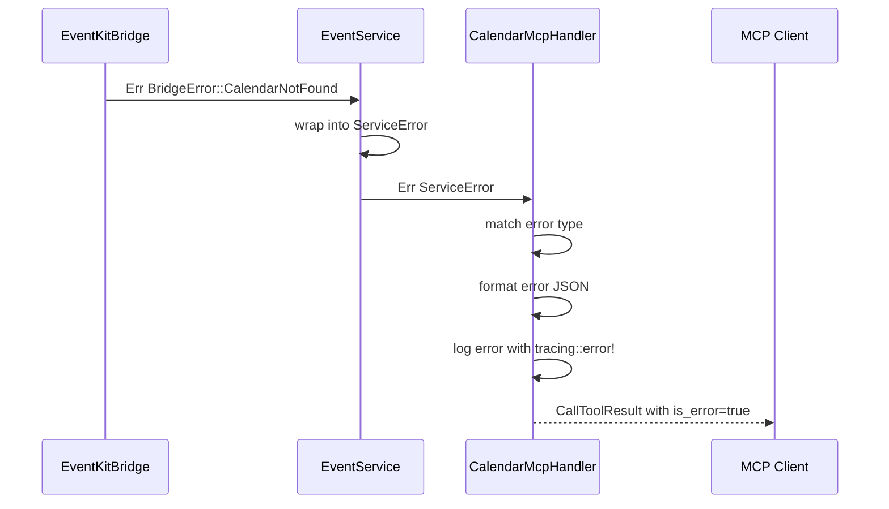

# Spec 07: Обработка ошибок, логирование и интеграция

**Metadata:**
- Priority: 7
- Status: Draft
- Effort: M (10-20 min)

## Overview
### Problem Statement
Необходима единая система обработки ошибок на всех слоях приложения, структурированное логирование для отладки, а также инструкции по интеграции MCP сервера с Claude Desktop и другими MCP клиентами.

### Solution Summary
Определить иерархию ошибок с использованием `thiserror`, настроить `tracing` для логирования, подготовить конфигурационные файлы для интеграции с Claude Desktop через stdio и SSE.

## Diagrams
### Sequence Diagram — Проброс ошибки через слои


## Requirements
### R1: Иерархия ошибок
Определить в `src/error.rs`:

```rust
/// Ошибки EventKit bridge слоя
#[derive(Debug, thiserror::Error)]
pub enum BridgeError {
    #[error("Calendar access denied. Grant access in System Settings > Privacy & Security > Calendars")]
    AccessDenied,
    
    #[error("Calendar not found: {0}")]
    CalendarNotFound(String),
    
    #[error("Event not found: {0}")]
    EventNotFound(String),
    
    #[error("Calendar does not allow modifications")]
    ModificationNotAllowed,
    
    #[error("No valid calendar source found")]
    NoValidSource,
    
    #[error("Invalid date format: {0}. Supported formats: ISO8601 with ms (2025-03-09T10:00:00.000Z), without ms (2025-03-09T10:00:00), with space (2025-03-09 10:00:00)")]
    InvalidDateFormat(String),
    
    #[error("EventKit error: {0}")]
    EventKitError(String),
    
    #[error("Objective-C runtime error: {0}")]
    ObjcError(String),
}

/// Ошибки сервисного слоя
#[derive(Debug, thiserror::Error)]
pub enum ServiceError {
    #[error(transparent)]
    Bridge(#[from] BridgeError),
    
    #[error("Validation error: {0}")]
    Validation(String),
}

/// Ошибки MCP слоя
#[derive(Debug, thiserror::Error)]
pub enum McpError {
    #[error(transparent)]
    Service(#[from] ServiceError),
    
    #[error("Unknown tool: {0}")]
    UnknownTool(String),
    
    #[error("Failed to deserialize tool arguments: {0}")]
    DeserializationError(String),
}
```

### R2: Логирование через tracing
- Использовать `tracing` crate с `tracing-subscriber` для форматированного вывода
- Инициализация в `main.rs`:
  ```rust
  tracing_subscriber::fmt()
      .with_env_filter(
          EnvFilter::try_from_default_env()
              .unwrap_or_else(|_| EnvFilter::new("info"))
      )
      .init();
  ```
- Уровни логирования:
  - `tracing::error!` — ошибки EventKit, неудачные операции
  - `tracing::warn!` — отсутствие доступа к календарю, не найденные ресурсы
  - `tracing::info!` — запуск сервера, успешные операции создания/удаления
  - `tracing::debug!` — детали запросов/ответов, параметры tools
  - `tracing::trace!` — низкоуровневые ObjC вызовы

### R3: Логирование ключевых событий
- При старте сервера: `info!("Starting mcp-macos-calendar server, transport: {stdio|sse}")`
- При запросе доступа: `info!("Requesting calendar access...")`
- При получении доступа: `info!("Calendar access granted")`
- При отказе доступа: `error!("Calendar access denied")`
- При каждом tool вызове: `debug!("Tool called: {name}, args: {args:?}")`
- При успешном выполнении: `debug!("Tool completed: {name}")`
- При ошибке: `error!("Tool error: {name}, error: {error}")`

### R4: Интеграция с Claude Desktop — stdio режим
Создать пример конфигурации для Claude Desktop `claude_desktop_config.json`:
```json
{
  "mcpServers": {
    "macos-calendar": {
      "command": "/path/to/mcp-macos-calendar",
      "args": ["--transport", "stdio"]
    }
  }
}
```

### R5: Интеграция с Claude Desktop — SSE режим
Конфигурация для SSE:
```json
{
  "mcpServers": {
    "macos-calendar": {
      "url": "http://127.0.0.1:8080/sse"
    }
  }
}
```

### R6: macOS Permissions
- При первом запуске macOS покажет диалог запроса доступа к календарю
- Если доступ был ранее отклонён, вывести инструкцию:
  ```
  Calendar access is not granted.
  To grant access: System Settings > Privacy & Security > Calendars
  Enable access for mcp-macos-calendar
  ```
- Проверять статус доступа при каждом запуске через `EKEventStore.authorizationStatus(for: .event)`
- Не завершать процесс при отсутствии доступа, но логировать warning

### R7: Graceful shutdown
- Обработать `Ctrl+C` через `tokio::signal::ctrl_c()`
- При получении сигнала: логировать `info!("Shutting down...")`, корректно завершить сервер
- Освободить ресурсы EventKit bridge через `Drop`

## Acceptance Criteria
- [ ] S07AC1: `BridgeError` содержит все 8 вариантов ошибок с человекочитаемыми сообщениями
- [ ] S07AC2: `ServiceError` оборачивает `BridgeError` через `#[from]`
- [ ] S07AC3: Ошибки логируются с `tracing::error!` на соответствующем уровне
- [ ] S07AC4: Успешные операции логируются с `tracing::info!`
- [ ] S07AC5: Уровень логирования настраивается через `RUST_LOG` env variable
- [ ] S07AC6: При отсутствии доступа к календарю выводится инструкция для пользователя
- [ ] S07AC7: Пример конфигурации Claude Desktop для stdio режима создан
- [ ] S07AC8: Пример конфигурации Claude Desktop для SSE режима создан
- [ ] S07AC9: Сервер корректно обрабатывает Ctrl+C и завершает работу
